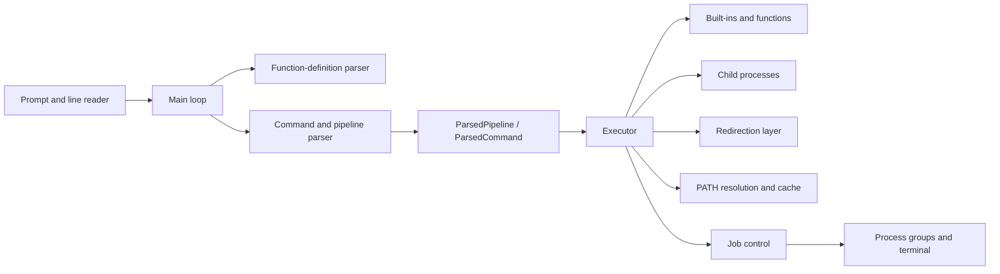

# Architecture

This document describes how `myShell` turns an input line into running
processes, where mutable shell state lives, and which component owns each Unix
resource. It reflects the current C++20 implementation.

## System overview

The shell is a single long-lived process. It parses each input line into plain
data, executes built-ins in the shell when their effects must persist, and
forks child processes for external commands, pipelines, and background work.

The important boundary is `ParsedPipeline`: parsing finishes before execution
starts. The parser does not fork, open redirection targets, change directories,
or modify the job table.

## Interactive lifecycle

[`src/main.cpp`](../src/main.cpp) coordinates the top-level lifecycle:

1. Initialize job control and claim the controlling terminal when interactive.
2. Configure the shell to ignore interactive signals that belong to foreground
   jobs.
3. Reap and report background job state changes.
4. Build a prompt and read one line.
5. Record non-empty input in the in-memory history.
6. Recognize a single-line function definition, or parse a pipeline.
7. Execute the parsed pipeline and store its shell-style status.
8. Repeat until end-of-file or the `exit` built-in requests termination.

`EXIT_SIGNAL` is an internal control value, not a Unix exit status. The
`exit` built-in stores the requested status in `shell_state.cpp`; the main loop
then performs the actual return from `main`.

## Parsed command model

[`include/myshell/parsed_command.hpp`](../include/myshell/parsed_command.hpp)
contains the data passed from parsing to execution.

- `ParsedCommand` holds the command name, arguments, leading environment
  assignments, and ordered redirections.
- `ParsedPipeline` holds one or more commands, the original display text, and
  whether a trailing `&` requested background execution.
- `Redirection` represents file opens, appends, descriptor duplication, and
  descriptor closure without performing them during parsing.

The `present` flag distinguishes an absent command from a valid command that
has no executable name, such as an assignment-only or redirection-only command.

## Parsing and expansion

[`src/tokenizer.cpp`](../src/tokenizer.cpp) contains two parsing layers:

- `parse_pipeline` finds unquoted pipeline separators and a trailing
  background operator. It delegates each stage to `parse_command`.
- `parse_command` tokenizes words and redirections while tracking single
  quotes, double quotes, escapes, and whether a leading word is a valid
  environment assignment.

Parameter expansion occurs while words are scanned. The supported forms are
`$NAME`, `${NAME}`, `$$`, and `$?`. Single quotes suppress expansion; double
quotes preserve the resulting text as one argument. Redirection operands go
through the same quote and expansion logic as other words.

Pipeline splitting is quote-aware. An escaped or quoted `|` or `&` remains
literal, and the `&` used by descriptor duplication such as `2>&1` is not
mistaken for background execution.

## Execution decisions

[`src/executor.cpp`](../src/executor.cpp) owns command dispatch and process
creation. Execution follows these rules:

| Parsed form | Execution location | Reason |
| --- | --- | --- |
| Foreground built-in | Shell process | Changes such as `cd` must persist. |
| Foreground shell function | Shell process | Function commands share shell state. |
| Assignment-only command | Shell process | The assigned environment persists. |
| External command | New process group | The program must replace a child process. |
| Pipeline | One child per stage, one process group | Stages run concurrently and share job state. |
| Background command | Child process group | The prompt must return immediately. |

Before dispatch, aliases are expanded. A foreground parent-side command uses
transactional environment and descriptor changes: temporary assignments and
redirections are applied, the command runs, and the original shell state is
restored. Assignment-only commands deliberately keep their environment changes.

Child execution follows a fixed order:

1. Join or create the pipeline's process group.
2. Restore default interactive signal dispositions.
3. Connect pipeline descriptors.
4. Apply environment assignments and explicit redirections.
5. Run a child-safe built-in/function or replace the child with an external
   executable.

The status of the final pipeline stage is the pipeline status. Normal exits
use their exit code; signal termination uses `128 + signal`.

## Environment and command lookup

Environment values use the process environment (`getenv`, `setenv`, and
`unsetenv`) as their current backing store.

- Assignment-only commands update the shell environment.
- Assignments before a command are saved and restored when the command runs in
  the shell process.
- Child commands inherit assignments through the environment used by `exec`.
- Assigning `PATH` clears the executable cache so stale paths are not reused.

[`src/path_search.cpp`](../src/path_search.cpp) searches `PATH`, distinguishes
“not found” from “found but not executable,” and maintains the cache exposed by
the `hash` built-in. Commands containing `/` bypass `PATH` lookup.

## Redirection ownership

[`src/redirection.cpp`](../src/redirection.cpp) applies redirections from left
to right, which preserves shell ordering semantics such as the difference
between `>file 2>&1` and `2>&1 >file`.

Children use `apply_redirections` because a failed child can simply exit.
Parent-side built-ins use `apply_redirections_transactionally`: every affected
descriptor is backed up above the command's descriptor range, and all original
open/closed states and close-on-exec flags are restored afterward.

The `exec` built-in is the exception. With no command it intentionally keeps
its descriptor changes; with a command it resets relevant signals and replaces
the shell process.

## Built-ins, aliases, and functions

[`src/builtins.cpp`](../src/builtins.cpp) contains the built-in registry. A
built-in is discoverable by `type` and callable by the executor once it is
added to the registry. Help text is maintained in the same component.

Aliases are expanded after parsing and before execution. Expansion replaces
the command word while preserving leading assignments, trailing arguments, and
redirections. A set of already-expanded names prevents alias cycles.

[`src/functions.cpp`](../src/functions.cpp) recognizes simple single-line
definitions. Function bodies are stored as command source strings and parsed
again at invocation time so dynamic values such as `$?` use the current shell
state. A recursion-depth limit in the executor prevents unbounded self-calls.

## Signals and job control

[`src/job_control.cpp`](../src/job_control.cpp) owns the job table, process
groups, terminal foreground group, and saved terminal modes.

- The interactive shell places itself in its own process group and claims the
  controlling terminal.
- Each external command or pipeline receives a distinct process group.
- A foreground job temporarily owns the terminal; the shell reclaims it after
  completion or stop.
- `Ctrl+C`, `Ctrl+\`, and `Ctrl+Z` are delivered by the terminal to the
  foreground job's process group, while the shell ignores those signals.
- `jobs`, `fg`, and `bg` inspect or transition entries in the job table.
- Background state changes are reaped before each prompt to avoid zombies and
  to report `Done` or `Stopped` jobs.

The line reader disables terminal-generated signals while editing, handles
`Ctrl+C` itself, and restores the original terminal settings before execution.
This lets control characters edit or cancel a prompt without killing the shell,
while foreground programs receive normal terminal signals.

## Supporting state and UI

- `shell_state.cpp` stores the most recent status and requested exit status.
- `history.cpp` stores session-only command history.
- `reader.cpp` owns raw-mode line editing and history navigation.
- `prompt.cpp` constructs the colored user, host, and working-directory prompt.
- `shell_ui.cpp` draws the optional launch screen and configures interactive
  signal dispositions.

These modules are intentionally small; parser and executor code should not need
to know how prompts are drawn or keystrokes are decoded.

## Tests

CTest builds three test executables:

- `tokenizer_tests` checks parsing, quoting, expansion, redirection syntax,
  pipelines, assignments, and background syntax.
- `shell_status_tests` runs non-interactive shell sessions and verifies exit
  statuses plus environment behavior.
- `interactive_signal_tests` uses pseudo-terminals to verify control-character
  handling, process groups, stopping, background execution, and `jobs`/`fg`/`bg`.

Pseudo-terminal coverage is important: pipes cannot reproduce terminal-driven
signals or foreground process-group behavior.

## Change guidelines

When extending the shell, preserve these invariants:

1. Parsing produces data and errors; it does not mutate operating-system state.
2. State-changing built-ins run in the parent only for foreground standalone
   commands.
3. Every pipeline stage belongs to the same job process group.
4. The shell, not a child, owns the terminal whenever a prompt is displayed.
5. Parent-side environment, redirection, and terminal changes are restored on
   every error path.
6. New syntax receives parser tests; process and terminal behavior receives
   end-to-end tests.

New source components should expose their public interface under
`include/myshell/`, be added to `CMakeLists.txt`, and keep Unix-specific resource
ownership explicit.
